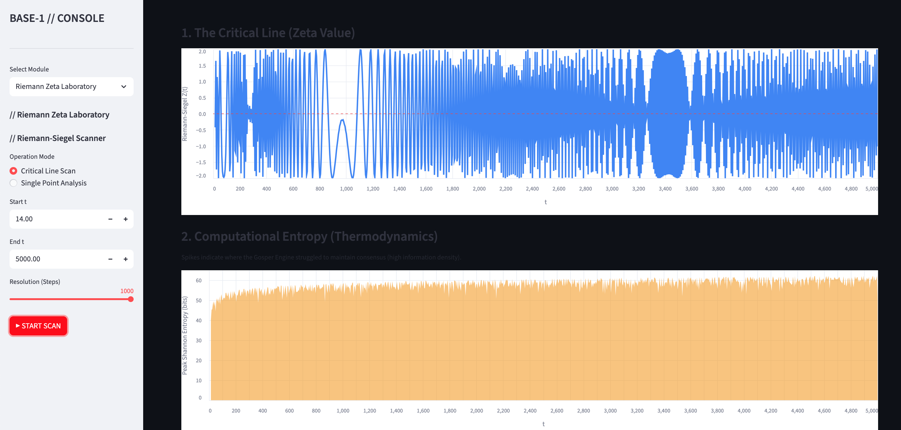

# Base-1

**A Unary Number Representation Implementation in Python**

  

Base-1 is implements a unary number representation system by treating the non-negative integer n as a python object that is forced to hold in memory a unary string of vertical bar characters `|` of length n. Addition, multiplication, and division are implemented as string manipulation on unary strings. Negative integers -n are represented as curried functions which hold a unary string of length n. Continued fractions are implemented as streams of unary strings, and continued fraction arithmetic is implemented using the gosper engine.

## Live Demo

Check out the [live demo here](https://base-1-srrnmbhh3rkmnk8ygcxhvb.streamlit.app/?embed=true)

## What's new in version 1.01

Compute the zero's of the zeta function and scan the critical line while measuring the entropy in the continued fraction arithmetic engine (Gosper Engine) during the computation.



## The Collatz Entropy Lab

**1. The Comparator (Dual-Stream Engine)**
Subtracts the finite field F_2^m from the Polynomial representation of the Collatz map. The **Error Map** ($A \oplus B$) visualizes the entropy generated by non linear carry propagation. See the code in `modules/comparator.py` for more information about the implementation details.


**2. Criticality Scanner (Mixing Lab)**
The engine's `science_mode` can be used for high performance numerical experiments. In the criticality scanner module you can inject massive sparse polynomials ($N = 2^{500} + 2^{250} + 1$) to locate the "bit-density" phase transition. The experiment measured a criticality threshold at **$\rho \approx 0.029$**.

---

## The Base-1 Engine (`/core`)

* **`core/science_mode.py`**: A high-performance wrapper for arbitrary-precision integer physics.
* **`core/galois.py`**: A factory for generating Finite Fields ($\mathbb{F}_{p^n}$) and performing arithmetic within them.
* **`core/unary.py`**: The fundamental "Matter Protocol" implementation.
* **`core/polynomial.py`**: A robust implementation of polynomial algebra supporting protocol-based coefficients.

## Quick Start

**Requirements:** Python 3.10+ (Required for structural pattern matching).

1.  **Clone the Repo:**
    ```bash
    git clone [https://github.com/calhoun137/Base-1.git](https://github.com/calhoun137/Base-1.git)
    cd Base-1
    ```

2.  **Install Dependencies:**
    ```bash
    pip install -r requirements.txt
    ```

3.  **Run the Lab:**
    ```bash
    streamlit run app.py
    ```

## Unit Tests

The engine has a robust suite of unit tests to ensure the fundamental arithmetic properties of this implementation of unary number representations are consistent with standard python int's

```bash
python -m pytest