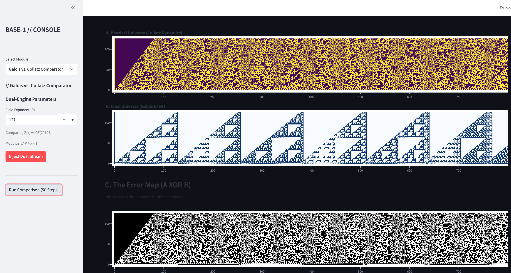

# Base-1

**A Constructivist Physics Engine for Arithmetic Dynamics**

  

> *"Mathematics is not yet ready for such problems."* — Paul Erdős

Base-1 is a computational research kernel designed to decouple "arithmetic" from "algebra." It treats numbers not as static values, but as dynamic collections of matter subject to physical laws (growth, entropy, decay).

## ⚡ Current Deployment: The Collatz Entropy Lab

We have configured the Base-1 engine to model the **Collatz Conjecture (3n+1)** as a fluid dynamics problem.

By simulating the map in a "Leaky Field" environment, we can isolate the **Entropy**—the exact "arithmetic friction" generated when the linear Generator (Galois Field) conflicts with the non-linear Dissipator (Integer Carry Propagation).

### 🔬 The Visualizers

**1. The Comparator (Dual-Stream Engine)**
Runs the "Physical Universe" (Integers) against the "Ideal Universe" (Galois Field). The **Error Map** ($A \oplus B$) visualizes the "heat" generated by carry propagation.



**2. Criticality Scanner (Mixing Lab)**
Using the engine's `science_mode`, we injected massive sparse polynomials ($N = 2^{500} + 2^{250} + 1$) to locate the bit-density phase transition. We detected a criticality threshold at **$\rho \approx 0.029$**, where the "friction" of arithmetic forces a collapse.

---

## 🛠️ The Base-1 Engine (`/core`)

The repository is structured as a modular lab. The core engine is located in `core/` and features a bespoke implementation of polynomial arithmetic over arbitrary Finite Fields.

* **`core/science_mode.py`**: A high-performance wrapper for arbitrary-precision integer physics.
* **`core/galois.py`**: A factory for generating Finite Fields ($\mathbb{F}_{p^n}$) and performing arithmetic within them.
* **`core/unary.py`**: The fundamental "Matter Protocol" implementation.
* **`core/polynomial.py`**: A robust implementation of polynomial algebra supporting protocol-based coefficients.

## 🚀 Quick Start

**Requirements:** Python 3.10+ (Required for structural pattern matching).

1.  **Clone the Repo:**
    ```bash
    git clone [https://github.com/your-username/Base-1.git](https://github.com/your-username/Base-1.git)
    cd Base-1
    ```

2.  **Install Dependencies:**
    ```bash
    pip install -r requirements.txt
    ```

3.  **Run the Lab:**
    ```bash
    streamlit run app.py
    ```

## 🧪 Verification

The engine is rigorously tested to ensure the "physics" of the simulation are accurate.

```bash
python -m pytest